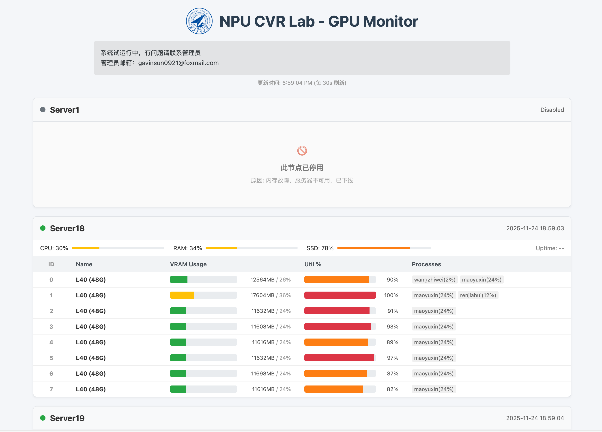

# 📊 GPU Cluster Monitor (Lightweight)

一个轻量级、无数据库、易扩展的实验室级 GPU 集群监控系统。 采用**节点主动推送 (Push)** 模式，前端实时解析 JSON 进行可视化展示。支持多行公告、ID 独立对齐、自定义 Logo 等特性。



## 📂 目录结构
本项目采用统一结构，**服务端**和**节点机**使用同一份代码包即可。
```
./
├── index.html                 # 前端主入口页面（已拆分 CSS + JS）
├── index.bak                  # 旧版本 HTML 备份，可删除或归档
├── README.md                  # 使用说明/部署文档
│
├── css/                       # 前端样式资源
│   ├── variables.css          # 主题变量（颜色、字体、基础样式）
│   ├── layout.css             # 页面布局（结构类样式）
│   └── components.css         # UI 组件类样式（卡片、表格、进度条等）
│
├── js/                        # 前端逻辑模块（已按功能拆分）
│   ├── config.js              # 加载配置（global.json / nodes.json）
│   ├── layout.js              # 负责 DOM 结构渲染 (renderLayout)
│   ├── updater.js             # 动态内容更新（GPU数据/进度条渲染）
│   └── main.js                # 应用入口，调度 refresh/interval/init逻辑
│
├── config/                    # JSON 配置文件
│   ├── global.json            # 全局页面设置（标题、刷新周期、公共公告）
│   └── nodes.json             # 集群节点定义、排序、状态、节点公告
│
├── images/                    # 静态图片资源
│   ├── logo.png               # Logo（顶部 header显示）
│   └── web.png                # 可作为 favicon 或备用图形
│
├── agent.py                   # GPU 信息采集脚本（Python版）
├── agent.sh                   # GPU 信息采集定时执行脚本（shell触发）
|
└── data/                      # 动态运行生成的 GPU 状态 JSON 数据
    ├── Server1.json
    ├── Server2.json
    └── ...
```

## 🚀 部署指南

### 角色 A：作为服务端 (Web Server)

适用于：汇总展示数据的机器 (需要安装 Nginx/Apache 或使用 Python HTTP)

1. 上传代码 将 NPUCVR-GPUWeb 文件夹完整放置在 Web 服务器目录下（例如 /var/www/html/gpu）。
2. 设置权限 (关键步骤) 必须赋予 data 目录写入权限，否则节点无法上传数据。
3. 配置节点 编辑 config/nodes.json，注册所有需要监控的节点名称（未注册的节点上传数据也不会显示）。
4. 访问 打开浏览器访问：http://gpu.npu-cvr.cn/

### 角色 B：作为节点机 (GPU Node)

适用于：被监控的显卡服务器

1. 下载代码 将 NPUCVR-GPUWeb 文件夹下载到节点机任意位置（例如 ~/NPUCVR-GPUWeb）。
2. 安装依赖 需要 Python 3 和 psutil 库。
    ```python
    pip3 install psutil
    ```
3. 配置上传路径 编辑 agent.sh，修改 TARGET_DIR 变量，使其指向服务端的实际绝对路径。
    ```python
    vim agent.sh
    ```
4. 配置免密 SSH 确保节点机可以免密传输文件到服务端。
    ```bash
    ssh-copy-id -p <SSH端口> <服务端用户>@<服务端IP>
    ```
5. 测试与定时任务
    ```shell
    # 1. 赋予执行权限
    chmod +x agent.sh

    # 2. 手动测试运行 (参数：节点名 远程用户 远程IP SSH端口)
    /home/user/NPUCVR-GPUWeb/agent.sh Server1 stuser 192.168.1.100 22
    # 如果没报错，且服务端的 data/ 目录下出现了 Server1.json，即成功。

    # 3. 添加 Crontab 定时任务 (每分钟采集一次)
    crontab -e
    # 添加如下行：
    * * * * * /home/user/NPUCVR-GPUWeb/agent.sh Server1 stuser 192.168.1.100 22 > /dev/null 2>&1
    ```

## ⚙️ 配置文件说明

所有配置修改后，刷新网页即可生效。

### 1. 全局配置 (config/global.json)
```json
{
    "title": "Lab GPU Center",      // 网页顶部大标题
    "announcement": "公告：\n1. 请注意显存占用", // 全局公告 (支持 \n 换行)
    "refresh_interval": 30          // 网页自动刷新间隔 (秒)
    "gpu_name_map": {
        "NVIDIA GeForce RTX 3090": "RTX 3090 (24G)", // 实际在网页中显示显卡的名称，可自定义
        "NVIDIA GeForce RTX 4090": "RTX 4090 (24G)",
        "NVIDIA A100-SXM4-80GB": "A100 80G",
        "NVIDIA L40": "L40 (48G)",
        "NVIDIA RTX 5880 Ada Generation": "RTX 5880 Ada (48G)"
    }
}
```

### 2. 节点管理 (config/nodes.json)
```json
{
    "Server10": {
        "status": "available",      // 状态颜色: available(绿), maintenance(黄), disabled(灰)
        "notice": "8卡 3090 推理节点\n请勿运行训练任务", // 节点专属公告 (支持 \n 换行)
        "order": 1                  // 排序权重 (越小越靠前)
    },
    "Server19": {
        "status": "maintenance",
        "notice": "显卡故障维修中",
        "order": 2
    }
}
```

